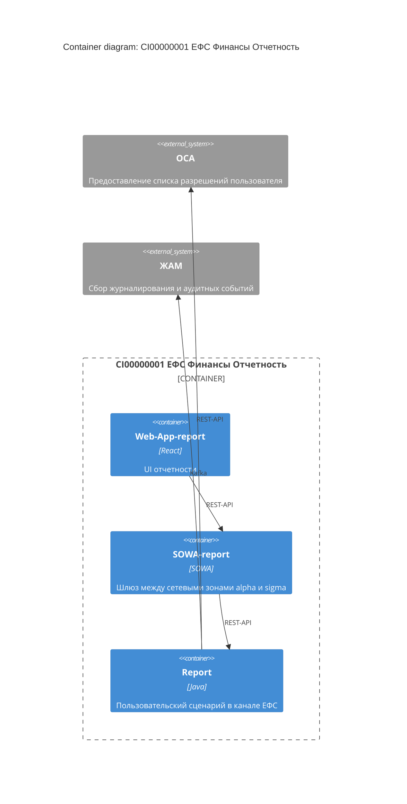
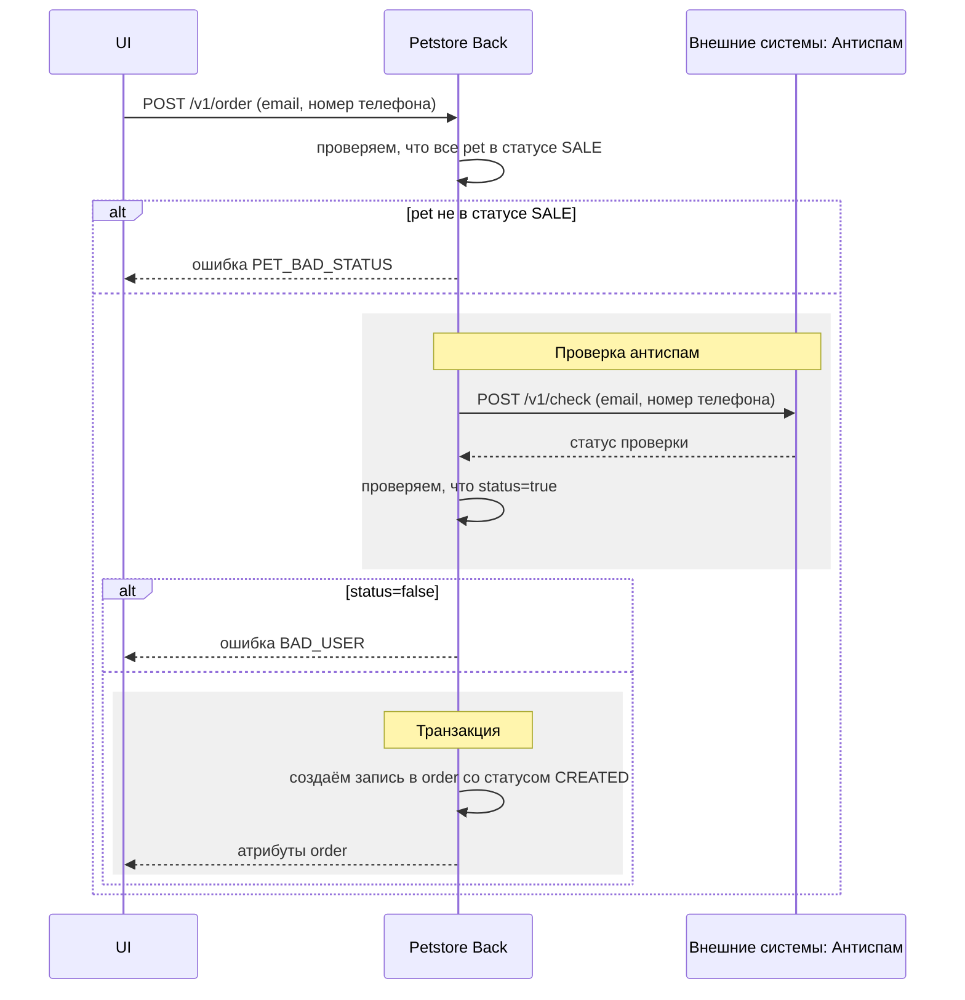
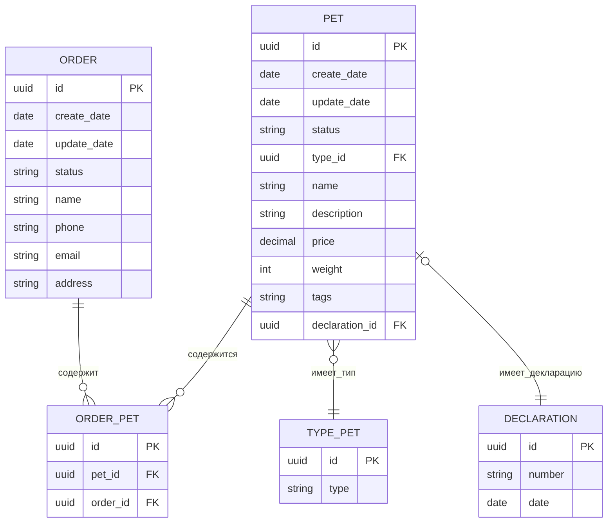
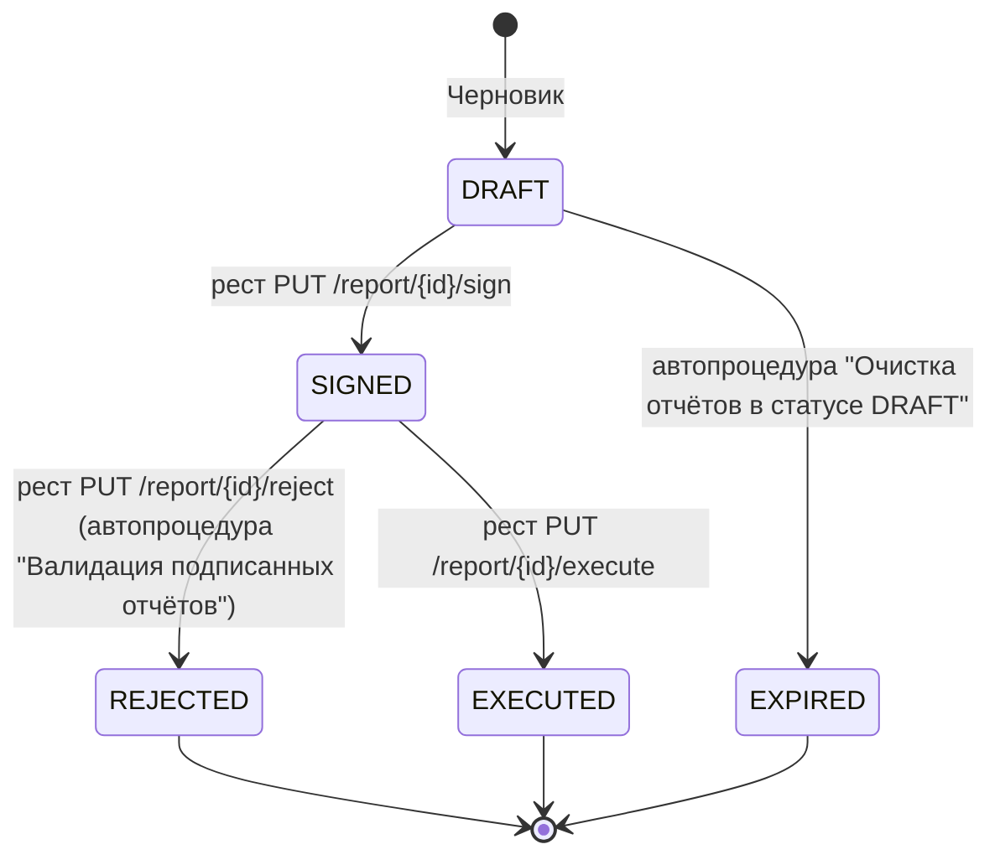
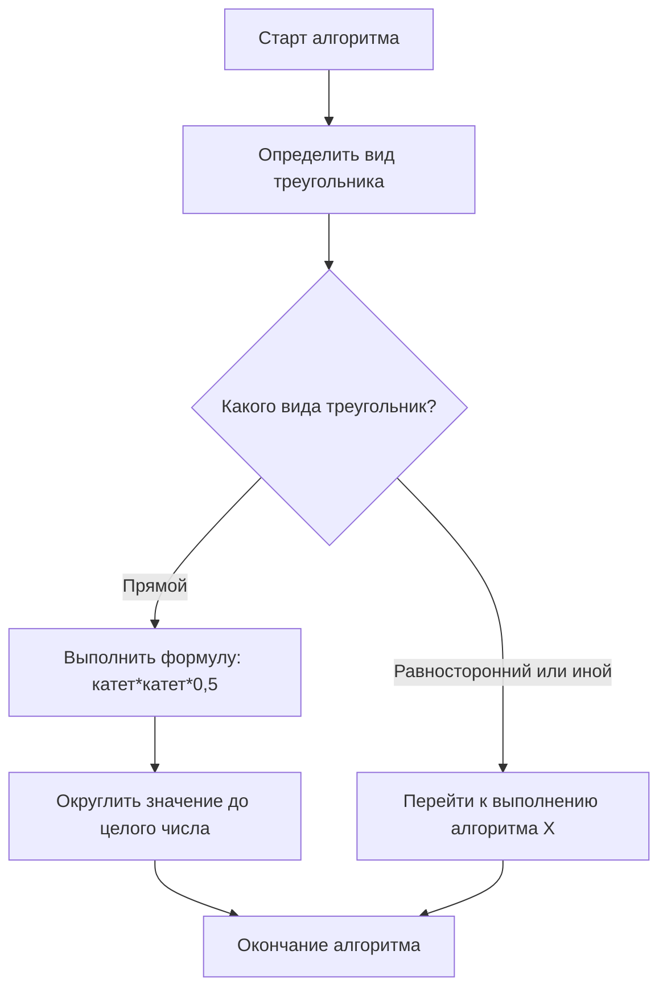

## Договорённости

<!-- Обязательный раздел. Договорённости \ согласования, связанные с текущей постановкой.
     Если договорённостей на текущий момент нет - раздел не удалять (они могут появиться позже), вместо пустой таблицы написать "Договорённостей на текущий момент нет". -->

| Артефакт | С кем договорились | Дата появления | Договоренность |
| --- | --- | --- | --- |
| | | | |

<!-- ПРИМЕР: не входит в текущую постановку, показывает только формат заполнения -->
**Пример:**

| Артефакт | С кем договорились | Дата появления | Договоренность |
| --- | --- | --- | --- |
| Ссылка на Confluence \ Jira | Через @ФИО ВП смежной команды | 05.04.24 | После реализации текущей постановки необходимо реализовать функционал X в системе А |
| Выгруженная ветка из почты | Через @ФИО Бизнес-аналитика | 4Q 2024 | Блокер для текущей постановки - функция Б из системы С. Функция Б по плану будет на ИФТ в конце декабря 25г |
<!-- /ПРИМЕР -->

## Изменение в архитектуре сервиса

<!-- Обязательный раздел. Изменения архитектуры, которые реализуются в рамках текущей постановки, в формате C4.
     1. Если в постановке реализуется вся архитектура - прикладывается ссылка на полную архитектуру из Технического описания Improvement с указанием версии страницы, указывается, что архитектура будет реализована полностью.
     2. Если в постановке реализуется часть архитектуры, допустимо выделить цветом изменения и приложить скрин общей архитектуры или нарисовать изменяемый кусочек (Draw.io, mermaid C4).
     3. Если изменений не предполагается - указывается "Отсутствуют", сам раздел не удаляется, т.к. важно явно обозначить отсутствие изменений. -->

<!-- ПРИМЕР: не входит в текущую постановку, показывает только формат заполнения -->
**Пример, когда архитектура реализуется частично:**

Архитектура реализуется частично.

В рамках текущей постановки делаем сервис X и Y. Сервис Z и его взаимодействие с сервисом X, Y не делаем, т.к. это будет реализовано в отдельной постановке.


<!-- /ПРИМЕР -->

## Изменения в предоставляемом API

<!-- Опциональный раздел - обязательно заполняется при доработке бэкенда.
     1. Все методы описываются в OpenAPI/yml (ссылка ниже); сам файл лежит рядом с постановкой под именем `openapi.yaml`.
     2. В текущей постановке в разделе "Описание методов и полномочий" перечисляются только новые/изменяемые/удаляемые методы.
     3. Хорошая статья по именованию методов: https://habr.com/ru/articles/351890/
     4. Если API не меняется - раздел не удалять, написать "Без изменений". -->

Ссылка на OpenAPI/yml: [openapi.yaml](./openapi.yaml)

### Описание методов и полномочий

<!-- Опционально - заполняется, если заполняется раздел "Изменения в предоставляемом API".
     Текстовый перечень методов с указанием полномочий и сценариев взаимодействия. -->

| Endpoint | Описание логики | Полномочия |
| --- | --- | --- |
| | | |

<!-- ПРИМЕР: не входит в текущую постановку, показывает только формат заполнения -->
**Пример:**

| Endpoint | Описание логики | Полномочия |
| --- | --- | --- |
| `post /v1/pet` | Создание записи в таблице pet | Pet.create |
| `get /v1/pet` | Получение записей из таблицы pet | Pet.view |
| `get /v1/pet/{objectId}` | Получение записи из таблицы pet | Pet.view |
| `post /v1/order` | Создание записи в таблице order | Order.create |
| `get /v1/order` | Получение записей из таблицы order | Order.view |
| `put /v1/order/{objectId}/cancel` | Перевод order в статус CANCELED | Order.create |
<!-- /ПРИМЕР -->

### Изменение в сценарии взаимодействия

<!-- Опционально - обязательно, если предполагается взаимодействие между микросервисами.
     Sequence-диаграмма в формате mermaid (```mermaid sequenceDiagram```), чтобы она рендерилась прямо в режиме просмотра md.
     Сценарии, которые не менялись, - не прикладываются. Если взаимодействия между сервисами нет вообще - написать "Без изменений". -->

<!-- ПРИМЕР: не входит в текущую постановку, показывает только формат заполнения -->
**Пример:**


<!-- /ПРИМЕР -->

### Изменения в кодах ошибок

<!-- Опционально - обязательно при изменении в ошибках. Ошибки, которые не меняются, - не прикладываются. Если коды ошибок не меняются вообще - написать "Без изменений". -->

| Код ошибки | Заголовок сообщения для пользователя | Сообщение для пользователя |
| --- | --- | --- |
| | | |

<!-- ПРИМЕР: не входит в текущую постановку, показывает только формат заполнения -->
**Пример:**

| Код ошибки | Заголовок сообщения для пользователя | Сообщение для пользователя |
| --- | --- | --- |
| UNKNOWN_EXCEPTION | Внутренняя ошибка сервера | Внутренняя ошибка сервера |
| VALIDATION_FAILED | Ошибка валидации | Проверьте корректность введенных данных |
| OBJECT_NOT_FOUND | Объект не найден | Объект не найден |
<!-- /ПРИМЕР -->

## Изменения в структуре базы данных

<!-- Опциональный раздел - обязателен при доработке бэкенда.
     1. Таблицы, которые не изменяются, - не отрисовываются.
     2. Необходимо описать схематично таблицы и их взаимосвязь (рекомендуется mermaid erDiagram, чтобы схема рендерилась в режиме просмотра md).
     3. Необходимо описать каждую таблицу отдельно в табличном виде.
     4. Если структура БД не меняется - раздел не удалять, написать "Без изменений". -->

### Таблица `<table_name>` (<назначение>)

| Наименование | PK | FK | Тип (длина) | Обязательный | Описание | Валидация | Пример |
| --- | --- | --- | --- | --- | --- | --- | --- |
| | +/- | +/- | | +/- | | | |

<!-- ПРИМЕР: не входит в текущую постановку, показывает только формат заполнения -->
**Пример:**



### Пример — Таблица `declaration` (таможенная декларация)

| Наименование | PK | FK | Тип (длина) | Обязательный | Описание | Валидация | Пример |
| --- | --- | --- | --- | --- | --- | --- | --- |
| id | + | + | uuid | + | Уникальный идентификатор | id должен быть уникальным в рамках типа документа | hsdgfhjsd76443 |
| number | - | - | varchar(15) | + | Номер документа | номер должен состоять из 15 символов, иначе выводится ошибка валидации | 123456789101234 |
| creation_date | - | - | date | + | Дата создания документа | дата записывается по маске ДД-ММ-ГГ. Валидация на корректность даты происходит на фронте, на беке - нет (согласно договоренности №6) | 02-02-22 |
<!-- /ПРИМЕР -->

## Изменения в интеграционном взаимодействии

<!-- Опциональный раздел - обязателен при изменении интеграции. Важно указать контракт, чтобы его зафиксировать. Если интеграции не меняются - раздел не удалять, написать "Без изменений". -->

### Сервис `<название>`

#### Документация

<!-- Ссылки на документацию/HowTo/CookBook поставщика интеграции -->

#### Контракт

<!-- Ссылка на yml/контракт -->

#### Описание логики

<!-- Для сложных интеграций - sequence-диаграмма в формате mermaid, чтобы она рендерилась в режиме просмотра md. В таблицах Request/Response - только используемые поля. -->

`<METHOD> <path>`

Request:

| Параметр в API | Обработка |
| --- | --- |
| | |

Response:

| Параметр в API | Обработка |
| --- | --- |
| | |

<!-- ПРИМЕР: не входит в текущую постановку, показывает только формат заполнения -->
**Пример: Сервис Антиспам**

#### Пример — Документация

Ссылки на документацию/HowTo/CookBook поставщика интеграции

#### Пример — Контракт

`01_01.000.00_antispam.yml`

#### Пример — Описание логики

Проверка антиспам

`post /v1/check`

Request:

| Параметр в API | Обработка |
| --- | --- |
| phone | Значение order.phone |
| email | Значение order.email |

Response:

| Параметр в API | Обработка |
| --- | --- |
| result.status | Если значение равно "SUCCESS", то в поле order.status записываем "CHECKED", иначе "FAILED" |
<!-- /ПРИМЕР -->

## Изменения в жизненном цикле

<!-- Опциональный раздел - обязателен, если меняются состояния сущности. Перечень состояний и логика переходов - state-диаграмма в формате mermaid (```mermaid stateDiagram-v2```), чтобы она рендерилась в режиме просмотра md. Если жизненный цикл не меняется - раздел не удалять, написать "Без изменений". -->

<!-- ПРИМЕР: не входит в текущую постановку, показывает только формат заполнения -->
**Пример: Жизненный цикл отчета**


<!-- /ПРИМЕР -->

## Изменения в UI-экранах

<!-- Опциональный раздел - обязателен при доработке фронта. UI, который не меняется, - не прикладывается.
     1. При реализации нового экрана - прикладывается скрин всего экрана из макета.
     2. При доработке существующего экрана - прикладывается скрин всего экрана, изменяемые элементы выделены цветом.
     3. Если у одного и того же экрана есть различие в элементах, необходимо приложить скрины со всеми вариациями.
     4. Если на экране есть типовые элементы, необходимо один раз описать их в разделе "Типовые сценарии" и ссылаться на это описание.
     5. Вместо экрана могут быть другие элементы: модальное окно, sidebar, виджет.
     6. Если UI не меняется - раздел не удалять, написать "Без изменений". -->

Ссылка на макеты: <!-- ссылка -->

### Экран - "<название>"

- Номер экрана: <!-- номер -->
- URL страницы: <!-- часть пути после имени сайта -->
- Особенности: <!-- для какой роли отображается, какой функционал доступен -->
- REST для отображения экрана: `<method> <path>`

Динамические элементы (статические - не описываются, они видны в дизайне):

| Наименование | Тип | Правила отображения | Редактирование/доступность | Обязательность | Заполнение | Связь с БД | Действие |
| --- | --- | --- | --- | --- | --- | --- | --- |
| | Кнопка/Текстовое поле/Datepicker/Colorpicker/Выпадающий список/Radiobutton/Checkbox | | | | Ручной ввод/enum/справочник/др. поле | | |

<!-- ПРИМЕР: не входит в текущую постановку, показывает только формат заполнения -->
**Пример: Экран - "Список публикаций"**

- Номер экрана: 1
- URL страницы: `/publication`
- Особенности: экран отображает список публикаций для роли пользователя "editor". Для этой роли присутствует функционал создания или изменения публикаций
- REST для отображения экрана: `get /publication`

| Наименование | Тип | Правила отображения | Редактирование/доступность | Обязательность | Заполнение | Связь с БД | Действие |
| --- | --- | --- | --- | --- | --- | --- | --- |
| "Создать" | Кнопка | Отображается для полномочия пользователя "Editor", для полномочия "Viewer" - не отображается | | | | | При нажатии открывается форма создания публикации; вызывается метод `get publication` |
| "Фильтры" | Кнопка | | | | | | При нажатии открывается сайдбар с фильтрами |
| "Поиск" | Текстовое поле | | | | Ручной ввод | | После ввода вызывается `get publications` с поисковым запросом в query-параметре |
<!-- /ПРИМЕР -->

## Изменения в печатных формах

<!-- Опциональный раздел - обязателен, если в процессе есть формирование печатных форм. Если печатных форм нет или они не меняются - раздел не удалять, написать "Без изменений". -->

### `<название печатной формы>`

Шаблон: <!-- ссылка -->
Примеры: <!-- ссылки -->

**Заполнение полей**

| Поле | Заполнение | Обязательность |
| --- | --- | --- |
| | <!-- источник заполнения --> | <!-- для необязательного поля - как ведёт себя форма при отсутствии значения --> |

<!-- ПРИМЕР: не входит в текущую постановку, показывает только формат заполнения -->
**Пример: Товарная накладная**

Шаблон: `01_Накладная_поля.docx`
Примеры: `01_Накладная_пример.pdf`, `01_Накладная_пример.docx`

**Заполнение полей**

| Поле | Заполнение | Обязательность |
| --- | --- | --- |
| DATE | Значение order.date в формате ДД.ММ.ГОД | + |
| NAME | Значение order.name | + |
| ADDRESS | Значение order.address | + |
| PHONE | Значение order.phone | - при отсутствии значения строка не отображается |
| EMAIL | Значение order.email | + |
<!-- /ПРИМЕР -->

## Ролевая модель

<!-- Опциональный раздел - обязателен, если есть ролевое разграничение. Всегда указываются ВСЕ роли, участвующие в процессе, независимо от того, были ли изменения. Если ролевого разграничения в процессе нет вообще - раздел не удалять, написать "Без изменений". -->

| Роль | Полномочие | Описание полномочия |
| --- | --- | --- |
| | | |

<!-- ПРИМЕР: не входит в текущую постановку, показывает только формат заполнения -->
**Пример:**

| Роль | Полномочие | Описание полномочия |
| --- | --- | --- |
| Vet - ветеринар | Pet.create | Создание карточки питомца |
| | Pet.view | Просмотр карточки питомца |
| | Order.view | Просмотр карточки заказа |
| Saler - покупатель | Pet.view | Просмотр карточки питомца |
| | Order.create | Создание карточки заказа |
| | Order.view | Просмотр карточки заказа |
<!-- /ПРИМЕР -->

## Алгоритмы и преобразования

<!-- Опциональный раздел - обязателен при изменении алгоритма/преобразования (например, JSON в XML).
     Допустимо описать только текстом, если шагов немного и разветвлений мало. При описании в схематичном виде (mermaid flowchart, чтобы схема рендерилась в режиме просмотра md) - обязательно дополнительное текстовое описание.
     Если алгоритмы/преобразования не меняются - раздел не удалять, написать "Без изменений". -->

<!-- ПРИМЕР: не входит в текущую постановку, показывает только формат заполнения -->
**Пример: алгоритм по расчету площади прямого треугольника**

Для других типов треугольника алгоритмы описаны в других постановках:
1. Определить вид треугольника
2. Если нет сторон, образующих прямой угол, - запустить алгоритм по расчету площади на основании высоты и основания треугольника (реализован в другой постановке)
3. Если стороны найдены - рассчитать формулу - произведение длины катетов на 0,5
4. Полученное число округлить до целого числа


<!-- /ПРИМЕР -->

## Изменения в аудите

<!-- Опциональный раздел - обязателен, если предполагается изменение в аудите. Указываются только создаваемые/изменяемые события. Если аудит не предполагается - явно указать "Требования не предъявлялись". -->

| № | Код КАП Журналирования | Наименование | Описание | Триггер |
| --- | --- | --- | --- | --- |
| | | | | |

### Атрибуты аудит-лога

<!-- Стандартный набор атрибутов события аудита, заполняется по атрибутам, актуальным для конкретных событий. -->

| Наименование | Обязательность | Описание | Пример |
| --- | --- | --- | --- |
| app_id | Да | ИД ФП подключения к КАП Журналирование | `EPM-CI04763767-CI06620491-202408050000000000` |
| type_id | Да | Тип лога: `Tech`/`Audit` | `Audit` |
| subtype_id | Да | Код из справочника аудита | `C1` |
| system | Да | Класс аудита для АС ПКБ и/или ППРБ (Единый Аудит): `soc`/`audit` | `["audit"]` |
| B_SystemID | Да | КЭ АС (формат `CIXXXXXXXX`) | `CI04763767` |
| SystemID_FP | Да | КЭ ФП (формат `CIXXXXXXXX`) | `CI06620491` |
| IP_ADDRESS | Да | IP адрес, откуда пришёл запрос пользователя | `192.168.0.0` |
| FQDN_ADDRESS | Да | FQDN узла АС или FQDN namespace АС в OpenShift | `os.dev.gen.ru` |
| USER_LOGIN | Да | Логин пользователя | `1111111` |
| STATUS | Да | Статус действия: `SUCCESS`/`FAIL` | `SUCCESS` |
| OPERATION_DATE | Да | Дата и время события, формат `YYYY-MM-DDThh:mm:ss±hh` | `2026-07-30T18:31:42+03` |
| REASON | Для определённых событий | Причина неуспешного действия | `not enough rights` |
| SESSION_ID | Для определённых событий | Идентификатор сессии пользователя, иначе `NO-SESSION` | `12121211221` |
| MESSAGE | Нет | Значения изменённых атрибутов: текущее и предыдущее значение | `{"PREV_PROPERTIES1":"123","PROPERTIES1":"444"}` |
| OBJECT_NAME | Для определённых событий | Наименование объекта | `object name` |
| OBJECT_ID | Для определённых событий | ИД объекта, при неуспешном событии `NO_ID` | `1111` |
| PROCESS_NAME | Для определённых событий | Приложение/процесс/сервис, при помощи которого произведено действие | `Service name` |
| OBJECT_PROPERTIES | Для определённых событий | Наименования изменённых свойств | `["name", "address"]` |
| TRACE_ID | Нет | Используется для распределённой трассировки запросов | `4bf92f3577b34da6a3ce929d0e0e4736` |

<!-- ПРИМЕР: не входит в текущую постановку, показывает только формат заполнения -->
**Пример: список аудит-логов**

| № | Код КАП Журналирования | Наименование | Описание | Триггер |
| --- | --- | --- | --- | --- |
| 1 | С3, С4 | PETSTORE_PET_CREATE | Создание записи о питомце | `post /v1/pet` |
| 2 | С3, С4 | PETSTORE_PET_UPDATE | Изменение записи о питомце | `put /v1/pet` |
| 3 | С5, С6 | PETSTORE_PET_DELETE | Удаление записи о питомце | `delete /v1/pet` |
| 4 | С3, С4 | PETSTORE_ORDER_CREATE | Создание записи о заказе | `post /v1/order` |
| 5 | С3, С4 | PETSTORE_ORDER_UPDATE | Изменение записи о заказе | `put /v1/order` |
| 6 | С5, С6 | PETSTORE_ORDER_DELETE | Удаление записи о заказе | `delete /v1/order` |
<!-- /ПРИМЕР -->

## Изменения в мониторинге

<!-- Опциональный раздел - обязателен, если предполагается мониторинг событий. Указываются только создаваемые/изменяемые метрики. Если мониторинг не меняется - раздел не удалять, написать "Без изменений". -->

| Триггер | Наименование метрики | Описание результата |
| --- | --- | --- |
| | | |

<!-- ПРИМЕР: не входит в текущую постановку, показывает только формат заполнения -->
**Пример:**

| Триггер | Наименование метрики | Описание результата |
| --- | --- | --- |
| `post /v1/pet` | PETSTORE_PET_CREATE_TIME | Время выполнения запросов к сервису `post /v1/pet` |
| | PETSTORE_PET_CREATE_SUCCESS | Количество запросов к сервису `post /v1/pet`, завершившихся успехом |
| | PETSTORE_PET_CREATE_FAIL | Количество запросов к сервису `post /v1/pet`, завершившихся неудачей |
| `post /v1/check` | ANTISPAM_CHECK_TIME | Время выполнения запросов к сервису `post /v1/check` |
<!-- /ПРИМЕР -->

## Изменения в уведомлениях

<!-- Опциональный раздел - обязателен, если предполагается отправка уведомлений (email/sms/push) по итогу действий. Если уведомлений нет - раздел не удалять, написать "Без изменений". -->

| Уведомление | Триггер | Канал | Получатель | Сообщение | Заполнение полей |
| --- | --- | --- | --- | --- | --- |
| | | email/sms/push | | | |

<!-- ПРИМЕР: не входит в текущую постановку, показывает только формат заполнения -->
**Пример:**

| Уведомление | Триггер | Канал | Получатель | Сообщение | Заполнение полей |
| --- | --- | --- | --- | --- | --- |
| Новый заказ | Переход order в статус CHECKED | email | Значение системного параметра `email_business_support` | Тема: "Новый заказ". Сообщение: "Новый заказ {ID}" | ID = order.id |
| Новый заказ | Переход order в статус CHECKED | sms | Значение order.phone | "Заказ {ID} принят" | ID = order.id |
<!-- /ПРИМЕР -->

## Изменения в автопроцедурах

<!-- Опциональный раздел - обязателен, если есть автопроцедуры (задачи по расписанию/триггеру). Если автопроцедур нет - раздел не удалять, написать "Без изменений". -->

| Наименование автопроцедуры | Описание работы | Триггер запуска |
| --- | --- | --- |
| | | |

<!-- ПРИМЕР: не входит в текущую постановку, показывает только формат заполнения -->
**Пример:**

| Наименование автопроцедуры | Описание работы | Триггер запуска |
| --- | --- | --- |
| Очистка отчетов в статусе DRAFT | Все отчеты в статусе DRAFT, у которых `report.update_time + settings.draft_ttl < текущего времени`, переводятся в статус EXPIRED | Раз в 24 часа, в 00:00 по серверному времени |
<!-- /ПРИМЕР -->

## Изменения в системных параметрах

<!-- Опциональный раздел - обязателен, если есть параметры, настраиваемые без ПСИ. Если таких параметров нет - раздел не удалять, написать "Без изменений". -->

| Системное наименование параметра | Описание параметра | Значение по умолчанию | Система управления параметром |
| --- | --- | --- | --- |
| | | | |

<!-- ПРИМЕР: не входит в текущую постановку, показывает только формат заполнения -->
**Пример:**

| Системное наименование параметра | Описание параметра | Значение по умолчанию | Система управления параметром |
| --- | --- | --- | --- |
| settings.draft_ttl | Максимальное время жизни черновика (в секундах) | 86400 | ConfigMap |
<!-- /ПРИМЕР -->

## Изменения в нефункциональных требованиях

<!-- Опциональный раздел - обязателен, если есть особые требования к производительности/масштабируемости/языку и т.п. Если требования стандартные - указать "Требования не предъявлялись". -->

| Требование | Владелец требования |
| --- | --- |
| | |

<!-- ПРИМЕР: не входит в текущую постановку, показывает только формат заполнения -->
**Пример:**

| Требование | Владелец требования |
| --- | --- |
| Формирование отчета должно происходить не больше чем за 7 секунд | Бизнес-аналитик |
<!-- /ПРИМЕР -->

## Любой другой раздел, который важно обозначить

<!-- Например, структура передаваемых данных между микросервисами. Соблюдать уровни заголовков и стиль остальных разделов. -->

## Технические решения и риски

<!-- Ключевые технические решения с обоснованием (почему X, а не Y), известные риски/компромиссы (Риск → Митигация), план миграции/отката, открытые вопросы, которые можно безопасно отложить.
     Если по какому-то из пунктов сказать нечего - не удалять подзаголовок, написать "Без изменений"/"Не применимо". -->

**Решения:**

**Риски / компромиссы:**

**План миграции:**

**Открытые вопросы:**
